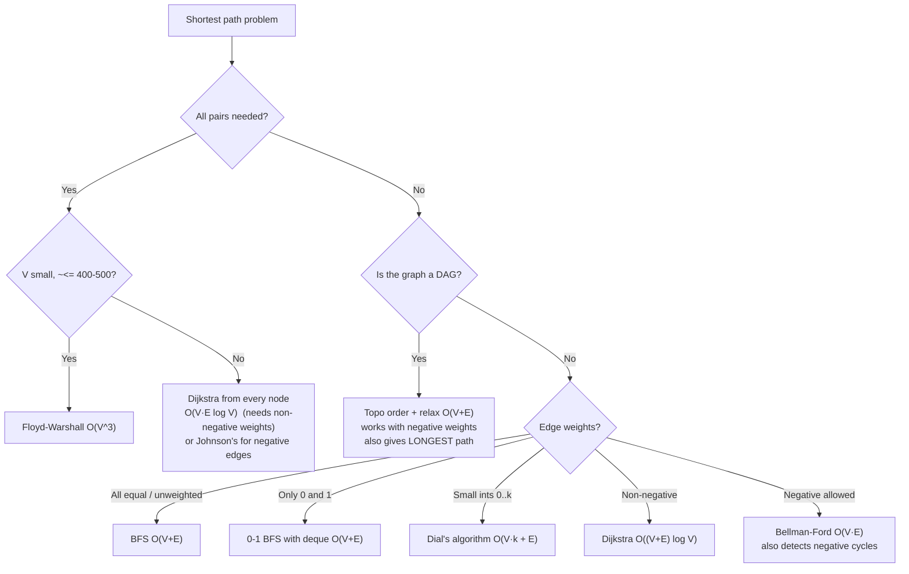

# Graphs — Complete Revision Sheet

> One-file reference: **idea → when to use → template → complexity → traps**.
> Read top-to-bottom the first time; after that use the [Master Complexity Table](#master-complexity-table) and the [Problem-Type → Algorithm Map](#problem-type--algorithm-map) as the entry points.

---

## Table of Contents

| # | Section | Core idea |
|---|---------|-----------|
| 0 | [Fundamentals & Representations](#0-fundamentals--representations) | How to store a graph |
| 1 | [Traversal: DFS & BFS](#1-traversal-dfs--bfs) | Visit everything once |
| 2 | [Grids as Graphs](#2-grids-as-graphs) | Implicit graphs |
| 3 | [Cycle Detection](#3-cycle-detection) | Back edges |
| 4 | [Bipartite Check](#4-bipartite-check) | 2-coloring |
| 5 | [Topological Sort](#5-topological-sort) | Dependency ordering (DAG) |
| 6 | [Shortest Paths](#6-shortest-paths) | BFS / 0-1 BFS / Dijkstra / Bellman-Ford / Floyd-Warshall / DAG-DP |
| 7 | [DSU (Union-Find)](#7-dsu-unionfind) | Dynamic connectivity |
| 8 | [Minimum Spanning Tree](#8-minimum-spanning-tree) | Cheapest connection of all nodes |
| 9 | [Strongly Connected Components](#9-strongly-connected-components-scc) | Directed "clusters" + condensation |
| 10 | [Bridges & Articulation Points](#10-bridges--articulation-points) | Critical edges/nodes |
| 11 | [Euler Path & Circuit](#11-euler-path--circuit) | Use every edge once |
| 12 | [Tree Algorithms](#12-tree-algorithms) | Diameter, LCA, binary lifting, rerooting |
| 13 | [Flow & Matching](#13-flow--matching) | Dinic, min-cut, bipartite matching |
| 14 | [2-SAT](#14-2-sat) | Boolean constraints via SCC |
| 15 | [Special Graph Patterns](#15-special-graph-patterns) | Functional graphs, state-space, layered graphs |
| 16 | [Master Complexity Table](#master-complexity-table) | Everything in one place |
| 17 | [Graph-Type Applicability Table](#graph-type-applicability-table) | Directed? Weighted? Negative? |
| 18 | [Problem-Type → Algorithm Map](#problem-type--algorithm-map) | "The problem says X → use Y" |
| 19 | [Common Bugs Checklist](#common-bugs-checklist) | What actually costs you the submission |

Notation used everywhere: **V** = number of vertices, **E** = number of edges.

---

## 0. Fundamentals & Representations

### Vocabulary you must be fluent in

| Term | Meaning |
|---|---|
| Degree | Number of incident edges. Directed graphs split into **indegree** / **outdegree**. |
| Simple graph | No self-loops, no parallel (multi) edges. |
| Multigraph | Parallel edges allowed — **breaks the naive undirected cycle check**. |
| Path / Walk | Walk may repeat vertices; a (simple) path may not. |
| Connected | Undirected: every pair reachable. |
| Strongly connected | Directed: every pair mutually reachable. |
| Weakly connected | Directed graph is connected if you ignore edge directions. |
| DAG | Directed **A**cyclic **G**raph. Everything about topological order lives here. |
| Tree | Connected, acyclic, undirected. Exactly `V - 1` edges, unique path between any two nodes. |
| Forest | Disjoint union of trees. |
| Dense vs sparse | Dense: `E ≈ V²` (matrix, Floyd-Warshall, O(V²) Dijkstra). Sparse: `E ≈ V` (adjacency list). |

**Sanity identities** (fast checks in problems):
- Undirected: `Σ deg(v) = 2E`. Number of odd-degree vertices is always even.
- Directed: `Σ indeg(v) = Σ outdeg(v) = E`.
- A connected undirected graph with `V` vertices and exactly `V - 1` edges **is a tree**.
- A connected undirected graph with `V` edges has exactly one cycle (a "unicyclic" graph / functional graph shape).

### Representations

```cpp
// 1) Adjacency list — THE default. Space O(V + E)
vector<vector<int>> adj(n);                    // unweighted
vector<vector<pair<int,int>>> adjW(n);         // weighted: {neighbour, weight}

// 2) Edge list — needed by Kruskal, Bellman-Ford
struct Edge { int u, v, w; };
vector<Edge> edges;

// 3) Adjacency matrix — Space O(V^2). Only when V is small (<= ~500) or
//    you need O(1) "is there an edge u-v?" / Floyd-Warshall.
vector<vector<int>> mat(n, vector<int>(n, INF));
```

**Reading input (0-indexing is safer, convert once at input):**

```cpp
int n, m; cin >> n >> m;
vector<vector<int>> adj(n);
for (int i = 0; i < m; i++) {
    int u, v; cin >> u >> v;
    u--; v--;                 // 1-indexed input -> 0-indexed storage
    adj[u].push_back(v);
    adj[v].push_back(u);      // DROP THIS LINE IF THE GRAPH IS DIRECTED
}
```

| Operation | Adjacency list | Adjacency matrix |
|---|---|---|
| Space | `O(V + E)` | `O(V²)` |
| Iterate neighbours of `u` | `O(deg(u))` | `O(V)` |
| Check edge `u→v` exists | `O(deg(u))` | `O(1)` |
| Add edge | `O(1)` | `O(1)` |

> **Rule of thumb:** adjacency list unless `V ≤ 500` *and* you need all-pairs or O(1) edge queries.

---

## 1. Traversal: DFS & BFS

Both visit every vertex and every edge once → **`O(V + E)` time, `O(V)` space** (plus recursion stack for DFS).

### 1.1 Recursive DFS

```cpp
vector<vector<int>> adj;
vector<bool> visited;

void dfs(int node) {
    visited[node] = true;             // mark on entry — the call itself is the "push"
    for (int neigh : adj[node]) {
        if (!visited[neigh]) dfs(neigh);
    }
}
```

- **Time** `O(V + E)` · **Space** `O(V)` for `visited` + `O(V)` recursion depth in the worst case (a path graph).
- ⚠️ Recursion depth `O(V)` — with `V = 2·10⁵` this is usually fine on Codeforces (stack ≈ 256 MB) but can stack-overflow if each frame is fat (passing vectors by value!). Always pass containers **by reference**, or go iterative.

### 1.2 Iterative DFS

```cpp
stack<int> st;
st.push(start);
vector<bool> visited(n, false);

while (!st.empty()) {
    int node = st.top(); st.pop();
    if (visited[node]) continue;      // mark on POP, not on push
    visited[node] = true;

    // push in reverse to match recursive DFS's neighbour order
    for (auto it = adj[node].rbegin(); it != adj[node].rend(); ++it)
        if (!visited[*it]) st.push(*it);
}
```

> **Important subtlety:** if you mark `visited` at *push* time (as in a BFS-style loop), you still get a valid DFS *reachability* traversal, but **not** the same visit order as recursive DFS — and a node may be "visited" long before it is processed. For pure reachability either is fine; for anything order-sensitive (topo sort, Tarjan), mark on pop or use recursion.

### 1.3 Disconnected graphs — always loop over all sources

```cpp
for (int i = 0; i < n; i++)
    if (!visited[i]) dfs(i);
```

Forgetting this is one of the most common WA causes. Same applies to BFS, cycle detection, bipartite, topo sort, SCC.

### 1.4 BFS

```cpp
queue<int> q;
q.push(start);
visited[start] = true;

while (!q.empty()) {
    int node = q.front(); q.pop();
    for (int neigh : adj[node]) {
        if (!visited[neigh]) {
            visited[neigh] = true;    // mark on PUSH — prevents duplicate queue entries
            q.push(neigh);
        }
    }
}
```

> In BFS you **must** mark on push. Marking on pop lets the same node enter the queue many times → up to `O(E)` queue entries and broken level ordering.

### 1.5 Connected components

```cpp
int components = 0;
for (int i = 0; i < n; i++) {
    if (!visited[i]) { components++; dfs(i); }
}
```

Component *id* labelling (useful later for merging / counting per-component stats):

```cpp
vector<int> comp(n, -1);
int c = 0;
for (int i = 0; i < n; i++) {
    if (comp[i] != -1) continue;
    queue<int> q; q.push(i); comp[i] = c;
    while (!q.empty()) {
        int u = q.front(); q.pop();
        for (int v : adj[u]) if (comp[v] == -1) { comp[v] = c; q.push(v); }
    }
    c++;
}
```

### 1.6 DFS edge classification (why DFS detects cycles)

Run DFS and classify each edge `u → v`:

| Edge type | Condition (using entry/exit times) | Meaning |
|---|---|---|
| Tree edge | `v` unvisited when explored from `u` | part of the DFS tree |
| **Back edge** | `v` is an ancestor (still on the recursion stack) | **cycle!** |
| Forward edge | `v` is a descendant already fully finished | directed graphs only |
| Cross edge | neither ancestor nor descendant | directed graphs only |

**Every cycle-detection algorithm in Section 3 is just "find a back edge".**

### 1.7 Multi-source BFS

Push *all* sources at distance 0. Gives, for each cell/node, the distance to the **nearest** source — in a single `O(V+E)` pass instead of one BFS per source.

```cpp
vector<int> dist(n, -1);
queue<int> q;
for (int s : sources) { dist[s] = 0; q.push(s); }

while (!q.empty()) {
    int u = q.front(); q.pop();
    for (int v : adj[u])
        if (dist[v] == -1) { dist[v] = dist[u] + 1; q.push(v); }
}
```

Classic uses: rotting oranges, distance to nearest 0 in a matrix, fire/flood spreading, "nearest special node".

---

## 2. Grids as Graphs

A grid is a graph you never build explicitly: **cell = node**, **adjacent cell = edge**.

```cpp
int dr[] = {-1, 1, 0, 0};                 // 4-directional
int dc[] = { 0, 0,-1, 1};
// 8-directional: {-1,-1,-1,0,0,1,1,1} / {-1,0,1,-1,1,-1,0,1}

auto inside = [&](int r, int c) {
    return r >= 0 && r < R && c >= 0 && c < C;
};

for (int d = 0; d < 4; d++) {
    int nr = r + dr[d], nc = c + dc[d];
    if (!inside(nr, nc) || grid[nr][nc] == '#' || vis[nr][nc]) continue;
    // ...
}
```

- **Complexity:** `V = R·C`, `E ≈ 4·R·C` → BFS/DFS is `O(R·C)`.
- Flatten a cell to an int when you need a 1-D array (DSU, dist): `id = r * C + c`, and back: `r = id / C, c = id % C`.
- **Flood fill** = DFS/BFS on a grid. Counting islands = counting connected components.
- Shortest path on an *unweighted* grid → **BFS** (never DFS — DFS finds *a* path, not the shortest).
- Grid with different terrain costs → **Dijkstra**. Costs only 0/1 → **0-1 BFS**.

> ⚠️ On large grids prefer iterative BFS: recursive flood fill on a 1000×1000 grid is 10⁶ deep and *will* stack overflow.

---

## 3. Cycle Detection

### 3.1 Undirected — DFS with parent

**Idea:** if you reach an already-visited vertex that is not the vertex you came from, you found a back edge → cycle.

```cpp
bool dfs(int node, int parent, vector<vector<int>>& adj, vector<bool>& visited) {
    visited[node] = true;
    for (int neigh : adj[node]) {
        if (!visited[neigh]) {
            if (dfs(neigh, node, adj, visited)) return true;
        }
        else if (neigh != parent) {
            return true;                     // back edge
        }
    }
    return false;
}

// driver (graph may be disconnected)
bool hasCycle(int n, vector<vector<int>>& adj) {
    vector<bool> visited(n, false);
    for (int i = 0; i < n; i++)
        if (!visited[i] && dfs(i, -1, adj, visited)) return true;
    return false;
}
```

> ⚠️ **Parallel edges break this.** If `u—v` appears twice, that *is* a cycle of length 2, but the `neigh != parent` test skips it. Fix: track the **edge index** you came from instead of the parent vertex.
>
> ```cpp
> // adj[u] holds {neighbour, edgeId}
> bool dfs(int node, int parentEdge) {
>     visited[node] = true;
>     for (auto [neigh, id] : adj[node]) {
>         if (id == parentEdge) continue;
>         if (visited[neigh]) return true;
>         if (dfs(neigh, id)) return true;
>     }
>     return false;
> }
> ```
>
> Self-loops (`u—u`) are also cycles; handle them explicitly if the input allows them.

### 3.2 Undirected — BFS variant

Push `{node, parent}` pairs; same logic.

```cpp
queue<pair<int,int>> q;                 // {node, parent}
q.push({src, -1}); visited[src] = true;
while (!q.empty()) {
    auto [u, p] = q.front(); q.pop();
    for (int v : adj[u]) {
        if (!visited[v]) { visited[v] = true; q.push({v, u}); }
        else if (v != p) return true;
    }
}
```

### 3.3 Directed — DFS with recursion stack (`pathVisited`)

**Idea:** in a directed graph, "already visited" is not enough — a cross edge into a finished component is not a cycle. The vertex must be **currently on the recursion stack**.

```cpp
bool dfs(int node, vector<vector<int>>& adj,
         vector<bool>& visited, vector<bool>& pathVisited) {
    visited[node] = true;
    pathVisited[node] = true;

    for (int neigh : adj[node]) {
        if (!visited[neigh]) {
            if (dfs(neigh, adj, visited, pathVisited)) return true;
        }
        else if (pathVisited[neigh]) {
            return true;                  // back edge to an in-progress node
        }
    }

    pathVisited[node] = false;            // MUST unmark on the way out
    return false;
}
```

### 3.4 Directed — 3-state colouring (same thing, one array)

More memory efficient and the version you should default to, because it's identical to the DFS topo-sort template.

```cpp
// 0 = unvisited, 1 = in progress (on stack), 2 = fully processed
bool dfs(int node, vector<vector<int>>& adj, vector<int>& state) {
    state[node] = 1;
    for (int neigh : adj[node]) {
        if (state[neigh] == 0) {
            if (dfs(neigh, adj, state)) return true;
        }
        else if (state[neigh] == 1) {
            return true;
        }
    }
    state[node] = 2;
    return false;
}
```

### 3.5 Directed — Kahn's algorithm (BFS)

Run topological sort; if fewer than `n` nodes come out, the leftovers form a cycle. See §5.1.

### 3.6 Printing the actual cycle

```cpp
vector<int> parent(n, -1), state(n, 0);
int cycleStart = -1, cycleEnd = -1;

bool dfs(int u) {
    state[u] = 1;
    for (int v : adj[u]) {
        if (state[v] == 0) { parent[v] = u; if (dfs(v)) return true; }
        else if (state[v] == 1) { cycleStart = v; cycleEnd = u; return true; }
    }
    state[u] = 2;
    return false;
}
// then: walk cycleEnd back via parent[] until cycleStart, push cycleStart, reverse.
```

| Variant | Time | Space | Works on |
|---|---|---|---|
| DFS + parent | `O(V+E)` | `O(V)` | Undirected |
| BFS + parent | `O(V+E)` | `O(V)` | Undirected |
| DFS + pathVisited / 3-state | `O(V+E)` | `O(V)` | Directed |
| Kahn's (indegree) | `O(V+E)` | `O(V)` | Directed |
| DSU (union of edges) | `O(E·α)` | `O(V)` | Undirected only |

> **DSU cycle check (undirected):** for each edge, if `find(u) == find(v)` before uniting, that edge closes a cycle. Simple and fast, but gives you no cycle contents and **does not work for directed graphs**.

---

## 4. Bipartite Check

**Question:** can we 2-colour the vertices so no edge joins same-coloured endpoints?

**Equivalent statements (remember all three):**
- The graph is bipartite.
- The graph has **no odd-length cycle**.
- BFS layering never produces an edge within a layer.

Trees and forests are always bipartite. Any graph with a triangle is not.

```cpp
bool isBipartite(vector<vector<int>>& adj) {
    int n = adj.size();
    vector<int> color(n, -1);

    for (int i = 0; i < n; i++) {
        if (color[i] != -1) continue;

        queue<int> q; q.push(i); color[i] = 0;
        while (!q.empty()) {
            int node = q.front(); q.pop();
            for (int neigh : adj[node]) {
                if (color[neigh] == -1) {
                    color[neigh] = color[node] ^ 1;
                    q.push(neigh);
                }
                else if (color[neigh] == color[node]) {
                    return false;
                }
            }
        }
    }
    return true;
}
```

DFS version — pass the colour down:

```cpp
bool dfs(int u, int c, vector<vector<int>>& adj, vector<int>& color) {
    color[u] = c;
    for (int v : adj[u]) {
        if (color[v] == -1) { if (!dfs(v, c ^ 1, adj, color)) return false; }
        else if (color[v] == c) return false;
    }
    return true;
}
```

- **Time** `O(V + E)` · **Space** `O(V)`.
- Works for undirected graphs. For directed graphs "bipartite" normally means bipartite of the underlying undirected graph.
- **DSU variant** (offline, no colours needed): maintain a DSU of size `2n`; for edge `(u,v)` union `u` with `v+n` and `v` with `u+n`. If `find(u) == find(v)` at any point → odd cycle → not bipartite.

> **Why it matters beyond the check:** bipartite-ness unlocks **bipartite matching** (§13), and "2-colour / two groups / two teams / no two adjacent same" problems are always this.

---

## 5. Topological Sort

An ordering of vertices such that for every directed edge `u → v`, `u` appears before `v`.

- **Precondition: the graph must be a DAG.** A cycle makes ordering impossible — and both algorithms below detect that for free.
- **Not unique** in general. If the problem wants the *lexicographically smallest* ordering, swap Kahn's `queue` for a `priority_queue<int, vector<int>, greater<int>>` (cost becomes `O(V log V + E)`).
- There is exactly **one** topological order ⟺ every consecutive pair in the order is connected by an edge (⟺ Kahn's queue never holds 2+ nodes at once). Useful for "is the ordering uniquely determined?" problems.

### 5.1 Kahn's algorithm (BFS + indegree)

**Idea:** repeatedly take a node with no remaining prerequisites.

```cpp
vector<int> topoSort(int n, vector<vector<int>>& adj) {
    vector<int> indegree(n, 0);
    for (int u = 0; u < n; u++)
        for (int v : adj[u]) indegree[v]++;

    queue<int> q;
    for (int i = 0; i < n; i++)
        if (indegree[i] == 0) q.push(i);

    vector<int> topo;
    while (!q.empty()) {
        int node = q.front(); q.pop();
        topo.push_back(node);

        for (int neigh : adj[node]) {
            if (--indegree[neigh] == 0) q.push(neigh);
        }
    }

    if ((int)topo.size() != n) return {};   // cycle exists
    return topo;
}
```

`O(V + E)` time, `O(V)` space.

### 5.2 DFS (postorder + reverse)

**Idea:** we want `u` before `v`. DFS naturally *finishes* `v` before `u`. So record nodes at finish time and reverse.

> Put plainly: the node with no further dependencies finishes first, so it is the *last* element of the topological order. Collect finish order, then reverse.

```cpp
// state: 0 = unvisited, 1 = in progress, 2 = done
// returns true if a cycle is found
bool dfs(int node, vector<vector<int>>& adj, vector<int>& state, vector<int>& topo) {
    state[node] = 1;

    for (int neigh : adj[node]) {
        if (state[neigh] == 0) {
            if (dfs(neigh, adj, state, topo)) return true;
        }
        else if (state[neigh] == 1) {
            return true;                    // back edge => cycle
        }
    }

    state[node] = 2;
    topo.push_back(node);                   // postorder
    return false;
}

vector<int> topoSort(int n, vector<vector<int>>& adj) {
    vector<int> state(n, 0), topo;

    for (int i = 0; i < n; i++) {
        if (state[i] == 0 && dfs(i, adj, state, topo)) return {};   // cycle
    }

    reverse(topo.begin(), topo.end());
    return topo;
}
```

> 🐞 **Bugs that were in the draft version of this** (classic ones, worth internalising):
> 1. `state[node]` was tested inside the neighbour loop instead of `state[neigh]` — the check must be about the *neighbour*.
> 2. Missing comma in the parameter list (`vector<int>& state vector<int>& topo`).
> 3. The driver looped on `visited[i]` when only `state[]` existed.
>
> The rule: **inside the neighbour loop, every array access is indexed by `neigh`, never by `node`.**

### 5.3 What topological order unlocks

| Problem | How |
|---|---|
| Course schedule / build order / task dependency | Direct topo sort |
| Detect cycle in directed graph | `topo.size() != n` |
| Shortest **or longest** path in a DAG | Relax edges in topo order (§6.6) — works with negative weights |
| Count paths between two nodes in a DAG | DP over topo order: `ways[v] += ways[u]` |
| Longest chain / LIS-as-DAG | Longest path in DAG |
| Lexicographically smallest order | Kahn's + min-heap |
| Alien dictionary / order inference | Build edges from adjacent word comparisons, then topo sort |

---

## 6. Shortest Paths

**Definition:** given a graph and source `s`, compute `dist[v]` = minimum total cost of any path from `s` to `v`.

### 6.0 The decision tree



**One-line rule:** *unweighted → BFS · 0/1 → deque BFS · non-negative → Dijkstra · negative → Bellman-Ford · DAG → topo DP · all-pairs & small V → Floyd-Warshall.*

### 6.1 Unweighted — BFS

**Why it works:** BFS explores in non-decreasing distance order, so the **first** time you reach a node you have its shortest path.

```cpp
vector<int> shortestPath(int n, vector<vector<int>>& adj, int src) {
    vector<int> dist(n, -1);
    queue<int> q;
    dist[src] = 0; q.push(src);

    while (!q.empty()) {
        int node = q.front(); q.pop();
        for (int neigh : adj[node]) {
            if (dist[neigh] == -1) {
                dist[neigh] = dist[node] + 1;
                q.push(neigh);
            }
        }
    }
    return dist;                    // -1 = unreachable
}
```

`O(V + E)` time, `O(V)` space. Here `dist[] == -1` doubles as the visited array — don't keep a separate one.

**Path reconstruction** (applies to *every* algorithm in this section):

```cpp
vector<int> parent(n, -1);
// wherever you set dist[v] = ..., also set parent[v] = u;

vector<int> path;
for (int cur = target; cur != -1; cur = parent[cur]) path.push_back(cur);
reverse(path.begin(), path.end());
// if path.front() != src -> target unreachable
```

### 6.2 Non-negative weights — Dijkstra

```cpp
vector<long long> dijkstra(int n, vector<vector<pair<int,int>>>& adj, int src) {
    const long long INF = 1e18;
    vector<long long> dist(n, INF);

    priority_queue<pair<long long,int>,
                   vector<pair<long long,int>>,
                   greater<pair<long long,int>>> pq;      // MIN-heap

    dist[src] = 0;
    pq.push({0, src});

    while (!pq.empty()) {
        auto [d, u] = pq.top(); pq.pop();

        if (d > dist[u]) continue;                 // stale entry — skip

        for (auto [v, w] : adj[u]) {
            if (d + w < dist[v]) {
                dist[v] = d + w;
                pq.push({dist[v], v});             // "lazy deletion"
            }
        }
    }
    return dist;
}
```

- **Time** `O((V + E) log V)` with a binary heap (each edge can push once). **Space** `O(V + E)`.
- Dense graphs (`E ≈ V²`): the plain `O(V²)` array version (scan for the unvisited minimum each round) is *faster* — use it when `V ≤ 2000` and the graph is dense.
- **Why non-negative is required:** Dijkstra's invariant is *"the smallest-key node popped from the heap is final"*. A negative edge could later reduce an already-finalised distance, breaking the invariant.
- ⚠️ Use `long long` for distances. `n = 2·10⁵` edges of weight `10⁹` overflows `int` instantly.
- ⚠️ `INF = 1e18` not `LLONG_MAX` — otherwise `dist[u] + w` overflows. The `d > dist[u]` guard also means you never relax from an `INF` node.
- ⚠️ `priority_queue` is a **max**-heap by default. `greater<>` makes it a min-heap. Forgetting this is the single most common Dijkstra bug.

**Variants worth knowing:**

| Variant | Change |
|---|---|
| Count number of shortest paths | Keep `ways[]`; on strict improvement `ways[v] = ways[u]`, on tie `ways[v] += ways[u]` |
| Minimise cost, tie-break on number of edges | Push `{dist, edges, node}` and compare lexicographically |
| Maximum bottleneck / "minimise the largest edge on the path" | Replace `d + w` with `max(d, w)` in the relaxation |
| Maximum probability path | `max`-heap, relaxation `p[u] * w` |
| K-th shortest path | Allow up to `k` pops per node instead of 1 |
| Multi-source | Push all sources with `dist = 0` |

### 6.3 Weights ∈ {0, 1} — 0-1 BFS

**Idea:** a deque behaves like a 2-bucket priority queue. Weight-0 edges go to the **front**, weight-1 edges to the **back**, which keeps the deque sorted by distance automatically.

```cpp
vector<int> zeroOneBFS(int n, vector<vector<pair<int,int>>>& adj, int src) {
    const int INF = 1e9;
    vector<int> dist(n, INF);
    deque<int> dq;

    dist[src] = 0;
    dq.push_front(src);

    while (!dq.empty()) {
        int u = dq.front(); dq.pop_front();

        for (auto [v, w] : adj[u]) {
            if (dist[u] + w < dist[v]) {
                dist[v] = dist[u] + w;
                if (w == 0) dq.push_front(v);
                else        dq.push_back(v);
            }
        }
    }
    return dist;
}
```

- **Time** `O(V + E)`, **Space** `O(V)`.
- A node can enter the deque more than once; the `dist[u] + w < dist[v]` check keeps it amortised linear. (Optional micro-optimisation: store `{d, u}` in the deque and `continue` when `d > dist[u]`.)
- **Classic use:** grid where moving in your current direction is free but turning costs 1; or "minimum number of walls to break".
- **Generalisation — Dial's algorithm:** weights in `0..k` → `k·V + 1` buckets instead of a heap, `O(V·k + E)`.

### 6.4 Negative weights — Bellman-Ford

**Idea:** forget greedy. Just relax **every** edge, `V - 1` times. After round `i`, every shortest path using `≤ i` edges is correct, and a shortest simple path uses at most `V - 1` edges.

```cpp
struct Edge { int u, v, w; };

vector<long long> bellmanFord(int n, vector<Edge>& edges, int src) {
    const long long INF = 1e18;
    vector<long long> dist(n, INF);
    dist[src] = 0;

    for (int i = 0; i < n - 1; i++) {
        bool changed = false;
        for (auto [u, v, w] : edges) {
            if (dist[u] == INF) continue;              // avoid overflow
            if (dist[u] + w < dist[v]) {
                dist[v] = dist[u] + w;
                changed = true;
            }
        }
        if (!changed) break;                           // early exit
    }
    return dist;
}
```

**Negative cycle detection — run one extra round:**

```cpp
bool hasNegativeCycle(int n, vector<Edge>& edges, vector<long long>& dist) {
    const long long INF = 1e18;
    for (auto [u, v, w] : edges) {
        if (dist[u] != INF && dist[u] + w < dist[v]) return true;
    }
    return false;
}
```

**Why:** without a negative cycle no shortest path needs more than `V - 1` edges, so nothing can improve in round `V`. If something still improves, you are looping around a cycle with negative total weight.

- **Time** `O(V · E)`, **Space** `O(V)`.
- ⚠️ This only detects negative cycles **reachable from `src`**. To detect *any* negative cycle, initialise all `dist[] = 0` (equivalent to a virtual super-source connected to everything).
- To *find* the cycle: remember `parent[]`, take the vertex `v` relaxed in round `V`, walk `parent` back `V` times to land inside the cycle, then follow it around.
- **Undirected graphs with negative edges:** Bellman-Ford does **not** work — a single negative undirected edge is itself a negative cycle (`u→v→u`).
- **SPFA** (queue-based Bellman-Ford) is often much faster in practice, average ≈ `O(E)`, but worst case is still `O(V·E)` and there are anti-SPFA tests on Codeforces. Know it, don't rely on it.

### 6.5 All pairs — Floyd-Warshall

**Idea:** `dist[i][j] = min(dist[i][j], dist[i][k] + dist[k][j])` — "does routing through `k` help?" — trying every intermediate `k`.

```cpp
const int INF = 1e9;

void floydWarshall(int n, vector<Edge>& edges, vector<vector<int>>& dist) {
    dist.assign(n, vector<int>(n, INF));
    for (int i = 0; i < n; i++) dist[i][i] = 0;

    for (auto [u, v, w] : edges) {
        dist[u][v] = min(dist[u][v], w);        // min() handles parallel edges
        // dist[v][u] = min(dist[v][u], w);     // add this line if UNDIRECTED
    }

    for (int k = 0; k < n; k++)                 // k MUST be the outermost loop
        for (int i = 0; i < n; i++)
            for (int j = 0; j < n; j++) {
                if (dist[i][k] == INF || dist[k][j] == INF) continue;
                dist[i][j] = min(dist[i][j], dist[i][k] + dist[k][j]);
            }
}
```

- **Time** `O(V³)`, **Space** `O(V²)`. Practical up to `V ≈ 400–500`.
- ⚠️ **`k` outermost.** The `k` loop is the DP dimension "intermediate vertices allowed = `{0..k}`". Any other order is simply wrong.
- ⚠️ The `INF` guard prevents `INF + INF` overflow and prevents fake paths through unreachable nodes.
- **Negative cycle detection:** after the loops, `dist[i][i] < 0` for some `i` ⟺ negative cycle through `i`. Handles negative edges fine, unlike Dijkstra.
- **Path reconstruction:** keep `nxt[i][j]`; initialise `nxt[u][v] = v`, and on improvement set `nxt[i][j] = nxt[i][k]`.
- **Transitive closure** (reachability, not distance): same triple loop with `reach[i][j] |= reach[i][k] && reach[k][j]`. With `bitset<N>` rows this becomes `O(V³/64)`.

### 6.6 DAG shortest (and longest) path — topo order DP

No heap needed: process vertices in topological order and relax outgoing edges. Each vertex is finalised before it's ever used as a source.

```cpp
vector<long long> dagShortestPath(int n, vector<vector<pair<int,int>>>& adj, int src) {
    const long long INF = 1e18;
    vector<int> topo = topoSortDAG(n, adj);     // Kahn's or DFS version

    vector<long long> dist(n, INF);
    dist[src] = 0;

    for (int u : topo) {
        if (dist[u] == INF) continue;
        for (auto [v, w] : adj[u])
            dist[v] = min(dist[v], dist[u] + w);
    }
    return dist;
}
```

- **Time** `O(V + E)`, **Space** `O(V)`.
- **Works with negative edge weights** — a DAG can't contain a cycle, so it can't contain a negative cycle.
- **Longest path:** flip `min` to `max` and initialise with `-INF`. Longest path is NP-hard on general graphs but trivial on a DAG — this is why so many "maximum chain / maximum score path" problems force a DAG.

### 6.7 Summary of shortest-path algorithms

| Algorithm | Time | Space | Weights | Directed | Undirected | Negative edges | Detects neg. cycle |
|---|---|---|---|---|---|---|---|
| BFS | `O(V+E)` | `O(V)` | all equal | ✅ | ✅ | ❌ | — |
| 0-1 BFS | `O(V+E)` | `O(V)` | 0 / 1 | ✅ | ✅ | ❌ | — |
| Dial's | `O(V·k+E)` | `O(V·k)` | `0..k` | ✅ | ✅ | ❌ | — |
| Dijkstra (heap) | `O((V+E) log V)` | `O(V+E)` | any ≥ 0 | ✅ | ✅ | ❌ | — |
| Dijkstra (array) | `O(V²)` | `O(V²)` | any ≥ 0 | ✅ | ✅ | ❌ | — |
| Bellman-Ford | `O(V·E)` | `O(V)` | any | ✅ | ⚠️ not with negatives | ✅ | ✅ |
| SPFA | `O(V·E)` worst, ~`O(E)` avg | `O(V)` | any | ✅ | ⚠️ | ✅ | ✅ |
| Floyd-Warshall | `O(V³)` | `O(V²)` | any | ✅ | ✅ | ✅ | ✅ |
| DAG topo DP | `O(V+E)` | `O(V)` | any | ✅ (DAG only) | ❌ | ✅ | N/A (no cycles) |

> All of these work on **both directed and undirected** graphs (an undirected edge is just two directed edges) — **except** DAG topo DP, which is directed-acyclic only, and Bellman-Ford/SPFA which become meaningless on undirected graphs with negative edges.

---

## 7. DSU (Union-Find)

**Job:** maintain a collection of disjoint sets under merges, with near-`O(1)` queries.

```
Initially:      {A} {B} {C} {D} {E}
union(A,B)  ->  {A,B} {C} {D} {E}
union(C,D)  ->  {A,B} {C,D} {E}
union(B,D)  ->  {A,B,C,D} {E}
```

Two operations:
- `find(x)` — representative (root) of `x`'s component.
- `unite(a, b)` — merge the components containing `a` and `b`.

### 7.1 Naive version (and why it's too slow)

```cpp
int find(int x) {
    if (parent[x] == x) return x;
    return find(parent[x]);
}
```

Repeated unions can build a chain `A→B→C→D→E` of length `n`, making `find` `O(n)`.

### 7.2 Optimisation 1 — path compression

Make every node on the lookup path point straight at the root.

```cpp
int find(int x) {
    if (parent[x] == x) return x;
    return parent[x] = find(parent[x]);   // the whole optimisation is this assignment
}
```

### 7.3 Optimisation 2 — union by size (or rank)

Always attach the **smaller** tree under the **larger** root, so depth grows logarithmically at worst.

### 7.4 Final template (memorise this one)

```cpp
class DSU {
    vector<int> parent, sz;
    int comps;
public:
    DSU(int n) : parent(n), sz(n, 1), comps(n) {
        iota(parent.begin(), parent.end(), 0);
    }

    int find(int x) {
        if (parent[x] == x) return x;
        return parent[x] = find(parent[x]);
    }

    bool unite(int a, int b) {              // returns false if already together
        a = find(a); b = find(b);
        if (a == b) return false;

        if (sz[a] < sz[b]) swap(a, b);      // small -> large
        parent[b] = a;
        sz[a] += sz[b];
        comps--;
        return true;
    }

    bool same(int a, int b) { return find(a) == find(b); }
    int  size(int x)        { return sz[find(x)]; }
    int  components() const { return comps; }
};
```

- **Time:** `O(α(n))` amortised per operation, where `α` is the inverse Ackermann function — **≤ 4 for any input you'll ever see**, so treat it as `O(1)`. With only one of the two optimisations it's `O(log n)`.
- **Space:** `O(n)`.
- **Graph type:** undirected / "connectivity" only. DSU cannot express direction or deletion.
- ⚠️ `unite` must call `find` on both arguments first. Writing `parent[b] = a` with raw `a, b` is a silent correctness bug.
- ⚠️ Recursive `find` is `O(log n)` deep after union-by-size, so it's safe — but an **iterative** version avoids any doubt:
  ```cpp
  int find(int x) {
      int root = x;
      while (parent[root] != root) root = parent[root];
      while (parent[x] != root) { int nxt = parent[x]; parent[x] = root; x = nxt; }
      return root;
  }
  ```

### 7.5 What DSU is actually for

| Problem | How |
|---|---|
| Kruskal's MST | Cycle test while adding edges (§8.1) |
| Number of connected components | `comps` after all unions |
| "Are `u` and `v` connected?" (offline/incremental) | `same(u, v)` |
| Cycle detection in undirected graph | `unite` returns `false` → edge closes a cycle |
| Count islands as cells are added | Union with already-added neighbours |
| **Deleting** edges / connectivity over time | Reverse the timeline and *add* edges instead |
| Bipartite check / "two enemies" | DSU of size `2n` with `x` and `x+n` (§4) |
| Accounts merge, friend circles, redundant connection | Straight DSU |

### 7.6 Useful DSU extensions

- **Weighted / bipartite DSU:** store `rankParity[x]` = parity of the path from `x` to its root. Lets you answer "is `x` the same group or the opposite group from `y`?" — used for "x and y differ by d" constraint systems.
- **DSU with rollback:** skip path compression, use union-by-size only, and keep a stack of `(node, oldSize)` to undo. `O(log n)` per op, undoable — required for offline dynamic connectivity / divide & conquer on edges.
- **Small-to-large merging:** the same "always merge the smaller into the larger" idea applied to `set`/`map` payloads per component. Total `O(n log n)` merges. Common on trees for subtree-set queries.

---

## 8. Minimum Spanning Tree

**Spanning tree:** a subset of edges that connects all vertices with no cycle — exactly `V - 1` edges.
**MST:** a spanning tree of minimum total edge weight.

Key facts:
- **Undirected graphs only.** The directed analogue is a *minimum arborescence* (Chu–Liu/Edmonds), rarely needed.
- The MST itself may not be unique, but the **total weight is always unique**. The MST *is* unique if all edge weights are distinct.
- If the graph is disconnected you get a **minimum spanning forest** — one MST per component.
- **Cut property:** for any cut of the graph, the minimum-weight edge crossing that cut is in some MST. (This is why both algorithms below are correct.)
- **Cycle property:** the strictly maximum-weight edge of any cycle is in no MST.
- An MST is also a **minimum bottleneck spanning tree**: it minimises the largest edge on the path between any two nodes.

### 8.1 Kruskal's algorithm (sort + DSU)

**Idea:** sort edges cheapest-first; take an edge if it doesn't create a cycle. DSU answers "does it create a cycle?" in `O(α)`.

```cpp
struct Edge { int u, v, w; };

long long kruskal(int n, vector<Edge>& edges) {
    sort(edges.begin(), edges.end(),
         [](const Edge& a, const Edge& b) { return a.w < b.w; });

    DSU dsu(n);
    long long mstWeight = 0;
    int edgesUsed = 0;

    for (auto [u, v, w] : edges) {
        if (dsu.unite(u, v)) {
            mstWeight += w;
            if (++edgesUsed == n - 1) break;
        }
    }

    if (edgesUsed != n - 1) return -1;       // graph disconnected
    return mstWeight;
}
```

- **Time** `O(E log E)` (dominated by the sort; `E log E = E log V` up to a constant). **Space** `O(V + E)`.
- **Best when:** the graph is sparse, or you're already handed an edge list. This is the default MST algorithm for CP.

### 8.2 Prim's algorithm (grow a tree with a min-heap)

**Idea:** Kruskal asks *"what's the globally cheapest safe edge?"*. Prim asks *"I already have a tree — what's the cheapest edge that grows it?"*

```cpp
long long prim(int n, vector<vector<pair<int,int>>>& adj) {
    vector<bool> inMST(n, false);
    priority_queue<pair<long long,int>,
                   vector<pair<long long,int>>,
                   greater<pair<long long,int>>> pq;

    pq.push({0, 0});                         // {weight, node} — start anywhere
    long long mstWeight = 0;
    int verticesUsed = 0;

    while (!pq.empty()) {
        auto [w, u] = pq.top(); pq.pop();
        if (inMST[u]) continue;              // already connected more cheaply

        inMST[u] = true;
        mstWeight += w;
        verticesUsed++;

        for (auto [v, weight] : adj[u])
            if (!inMST[v]) pq.push({weight, v});
    }

    if (verticesUsed != n) return -1;        // disconnected
    return mstWeight;
}
```

- **Time** `O(E log V)` with a binary heap. **Space** `O(V + E)`.
- Dense graphs: the `O(V²)` array version (no heap — scan for the minimum `key[]` each round) is better, and is the right choice for complete graphs (e.g. "connect all points with minimum total distance", `V ≤ 1000`).
- ⚠️ Note the pair is `{weight, node}` — the **opposite** field order from Dijkstra's `{dist, node}` conceptually: Prim pushes the *edge* weight, Dijkstra pushes the *accumulated* distance. Mixing them up produces a wrong-but-plausible answer.

### 8.3 Kruskal vs Prim

| | Kruskal | Prim |
|---|---|---|
| Data structure | Sorted edge list + DSU | Adjacency list + min-heap (or array) |
| Time | `O(E log E)` | `O(E log V)` / `O(V²)` dense |
| Input shape | Edge list | Adjacency list |
| Best for | Sparse graphs, offline edges | Dense / complete graphs |
| Disconnected input | Naturally gives a spanning forest | Only covers the start component |
| Extends to | "add edges over time", second-best MST | Nothing special |

### 8.4 MST variants that show up

| Ask | Approach |
|---|---|
| Second-best MST | Build MST, then for each non-MST edge `(u,v,w)` compute `maxEdgeOnPath(u,v)` in the MST (binary lifting) and minimise `mst - maxEdge + w` |
| Critical edge (removing it increases MST cost) | Remove it, recompute; or: it's the unique min edge across some cut |
| Pseudo-critical edge | Force it in, recompute, check cost equals MST cost |
| Minimum bottleneck path between `u,v` | Max edge on the MST path between them |
| Connect points on a plane | Build the complete graph of distances → Prim `O(V²)` (or Delaunay/Boruvka for large `V`) |
| MST with one forced edge | Add it first, then Kruskal the rest |

> 🚫 **Do not confuse MST with shortest paths.** An MST does **not** give the minimum-cost path between two vertices.
> - Shortest path → minimise distance between *specified* vertices.
> - MST → minimise *total* cost of connecting *all* vertices.

---

## 9. Strongly Connected Components (SCC)

**Definition (directed graphs only):** a maximal set of vertices where every vertex can reach every other.

**Why it matters:** collapse each SCC into a single node and you get the **condensation graph**, which is always a **DAG**. Any hard directed-graph question becomes "SCC + then do the DAG thing".

### 9.1 Kosaraju's algorithm (2 passes + reverse graph)

**Idea:**
1. DFS the graph, push vertices onto a stack in **finish order**.
2. Reverse all edges.
3. Pop vertices from the stack; each new DFS on the reversed graph collects exactly one SCC.

```cpp
void dfs1(int u, vector<vector<int>>& adj, vector<bool>& vis, vector<int>& order) {
    vis[u] = true;
    for (int v : adj[u]) if (!vis[v]) dfs1(v, adj, vis, order);
    order.push_back(u);                       // finish order
}

void dfs2(int u, vector<vector<int>>& radj, vector<int>& comp, int c) {
    comp[u] = c;
    for (int v : radj[u]) if (comp[v] == -1) dfs2(v, radj, comp, c);
}

int kosaraju(int n, vector<vector<int>>& adj, vector<int>& comp) {
    vector<vector<int>> radj(n);
    for (int u = 0; u < n; u++)
        for (int v : adj[u]) radj[v].push_back(u);

    vector<bool> vis(n, false);
    vector<int> order;
    for (int i = 0; i < n; i++) if (!vis[i]) dfs1(i, adj, vis, order);

    comp.assign(n, -1);
    int c = 0;
    for (int i = n - 1; i >= 0; i--) {
        int u = order[i];
        if (comp[u] == -1) dfs2(u, radj, comp, c++);
    }
    return c;                                  // number of SCCs
}
```

`O(V + E)` time, `O(V + E)` space. Easiest to remember; needs the reverse graph.

### 9.2 Tarjan's algorithm (1 pass, low-link)

Single DFS, uses `disc[]` (discovery time) and `low[]` (lowest discovery time reachable). A vertex with `low[u] == disc[u]` is the **root of an SCC**; pop the stack down to it.

```cpp
int timer = 0, sccCount = 0;
vector<int> disc, low, comp; vector<bool> onStack; stack<int> st;

void tarjan(int u, vector<vector<int>>& adj) {
    disc[u] = low[u] = timer++;
    st.push(u); onStack[u] = true;

    for (int v : adj[u]) {
        if (disc[v] == -1) { tarjan(v, adj); low[u] = min(low[u], low[v]); }
        else if (onStack[v])  low[u] = min(low[u], disc[v]);   // back edge: use disc, not low
    }

    if (low[u] == disc[u]) {                  // u is an SCC root
        while (true) {
            int v = st.top(); st.pop(); onStack[v] = false;
            comp[v] = sccCount;
            if (v == u) break;
        }
        sccCount++;
    }
}
```

`O(V + E)`, one pass, no reverse graph. **Bonus:** Tarjan emits SCCs in **reverse topological order** of the condensation graph.

### 9.3 Condensation graph

```cpp
// after computing comp[] for every vertex
vector<vector<int>> cadj(sccCount);
for (int u = 0; u < n; u++)
    for (int v : adj[u])
        if (comp[u] != comp[v]) cadj[comp[u]].push_back(comp[v]);
// dedupe if needed; the result is a DAG -> topo sort / DAG DP now applies
```

| Question | Answer via condensation |
|---|---|
| Minimum nodes to add so that everything is reachable from one node | Count SCCs with indegree 0 |
| Minimum edges to add to make the whole graph strongly connected | `max(#indeg0, #outdeg0)` (and 0 if there is only 1 SCC) |
| Is there a node reachable from all nodes ("celebrity"/mother vertex) | The last SCC in topo order must have outdegree 0 and be unique |
| Longest path in a directed graph with cycles | Condense → longest path in DAG |
| 2-SAT | §14 |

---

## 10. Bridges & Articulation Points

**Undirected graphs.** Both use the same DFS `disc`/`low` machinery as Tarjan.

- **Bridge (cut edge):** removing it increases the number of connected components.
- **Articulation point (cut vertex):** removing it (and its edges) increases the number of components.

```cpp
int timer = 0;
vector<int> disc, low;
vector<bool> isArticulation;
vector<pair<int,int>> bridges;

void dfs(int u, int parent, vector<vector<int>>& adj) {
    disc[u] = low[u] = timer++;
    int children = 0;

    for (int v : adj[u]) {
        if (v == parent) { parent = -1; continue; }   // skip ONE parent edge (multi-edge safe)

        if (disc[v] != -1) {
            low[u] = min(low[u], disc[v]);            // back edge
        } else {
            dfs(v, u, adj);
            low[u] = min(low[u], low[v]);

            if (low[v] > disc[u]) bridges.push_back({u, v});          // BRIDGE
            if (low[v] >= disc[u] && parent != -1) isArticulation[u] = true;
            children++;
        }
    }
    if (parent == -1 && children > 1) isArticulation[u] = true;       // root case
}
```

**Read the conditions out loud:**
- `low[v] > disc[u]` → the subtree at `v` has **no** back edge to `u` or above → edge `u—v` is a bridge. **Strict** `>`.
- `low[v] >= disc[u]` → the subtree can climb at best to `u` itself → removing `u` disconnects it → `u` is an articulation point. **Non-strict** `>=`.
- **Root special case:** the DFS root is an articulation point iff it has **more than one** DFS child.

`O(V + E)` time, `O(V)` space.

⚠️ With parallel edges, "skip the parent" must skip only **one** copy of the parent edge (the `parent = -1` trick above, or track edge ids) — otherwise a genuine 2-edge connection is mistaken for a bridge.

**Uses:** critical connections in a network, biconnected components, finding all edges that lie on some cycle (= non-bridges), building the **bridge tree** (2-edge-connected components condensed into a tree).

---

## 11. Euler Path & Circuit

**Euler path:** uses **every edge exactly once**. **Euler circuit:** an Euler path that starts and ends at the same vertex.
(Contrast with **Hamiltonian** path, which visits every *vertex* once — NP-hard.)

### Existence conditions

| Graph | Euler circuit | Euler path (not circuit) |
|---|---|---|
| **Undirected** | All vertices have **even** degree, and all edges lie in one connected component | Exactly **2** vertices of odd degree (they are the endpoints) |
| **Directed** | `indeg(v) == outdeg(v)` for all `v`, and the graph is connected when viewed as one component | Exactly one vertex with `outdeg − indeg = 1` (start) and one with `indeg − outdeg = 1` (end); all others balanced |

Isolated vertices (degree 0) are ignored for the connectivity test.

### Hierholzer's algorithm

```cpp
// directed version; adj[u] is a list of neighbours, ptr[u] tracks how many are used
vector<int> hierholzer(int n, vector<vector<int>>& adj, int start) {
    vector<int> ptr(n, 0), path;
    stack<int> st;
    st.push(start);

    while (!st.empty()) {
        int u = st.top();
        if (ptr[u] < (int)adj[u].size()) {
            st.push(adj[u][ptr[u]++]);        // walk forward, consuming edges
        } else {
            path.push_back(u);                // stuck -> backtrack and record
            st.pop();
        }
    }
    reverse(path.begin(), path.end());
    return path;                              // size should be E + 1
}
```

`O(V + E)` time. For the undirected version you also need a `usedEdge[]` array indexed by edge id (each edge appears in two lists).

**Uses:** reconstructing a sequence from overlapping pairs (de Bruijn sequences), "draw this shape without lifting the pen", word-chain / domino-chain problems.

---

## 12. Tree Algorithms

A tree is a graph with `V` nodes, `V - 1` edges, connected and acyclic. Everything below is `O(V)` unless stated.

### 12.1 Rooting a tree

```cpp
vector<int> par(n, -1), depth(n, 0), sub(n, 1);

void dfs(int u, int p) {
    par[u] = p;
    for (int v : adj[u]) {
        if (v == p) continue;                // the ONLY "visited" check a tree needs
        depth[v] = depth[u] + 1;
        dfs(v, u);
        sub[u] += sub[v];                    // subtree sizes, computed on the way back
    }
}
```

### 12.2 Tree diameter (longest path between any two nodes)

**Two-BFS trick** (unweighted, or weighted with non-negative weights):
1. BFS/DFS from any node → find the farthest node `a`.
2. BFS/DFS from `a` → the farthest node `b`. `dist(a, b)` is the diameter.

**One-DFS DP** (works with negative weights too):

```cpp
long long best = 0;
long long dfs(int u, int p) {                 // returns longest downward path from u
    long long d1 = 0, d2 = 0;                 // two largest child depths
    for (int v : adj[u]) {
        if (v == p) continue;
        long long d = dfs(v, u) + 1;          // + w for weighted
        if (d > d1) { d2 = d1; d1 = d; }
        else if (d > d2) d2 = d;
    }
    best = max(best, d1 + d2);                // path bending at u
    return d1;
}
```

### 12.3 LCA via binary lifting

Preprocess `O(V log V)`, query `O(log V)`.

```cpp
int LOG;
vector<vector<int>> up;                       // up[k][v] = 2^k-th ancestor of v
vector<int> depth;

void build(int n, int root) {
    LOG = 1; while ((1 << LOG) < n) LOG++;
    up.assign(LOG + 1, vector<int>(n, -1));
    dfsInit(root, root);                      // fills up[0][v] = parent, depth[v]
    for (int k = 1; k <= LOG; k++)
        for (int v = 0; v < n; v++)
            up[k][v] = (up[k-1][v] == -1) ? -1 : up[k-1][ up[k-1][v] ];
}

int lca(int u, int v) {
    if (depth[u] < depth[v]) swap(u, v);
    int diff = depth[u] - depth[v];
    for (int k = 0; k <= LOG; k++)
        if (diff >> k & 1) u = up[k][u];      // lift u to v's depth
    if (u == v) return u;
    for (int k = LOG; k >= 0; k--)
        if (up[k][u] != up[k][v]) { u = up[k][u]; v = up[k][v]; }
    return up[0][u];
}

int distTree(int u, int v) { return depth[u] + depth[v] - 2 * depth[lca(u,v)]; }
```

Same table answers "k-th ancestor", "max edge weight on the path `u→v`" (store `maxUp[k][v]` alongside), and is the engine behind the second-best-MST trick.

**Alternatives:** Euler tour + sparse table (`O(1)` query), or **Tarjan's offline LCA** with DSU (`O((V+Q)·α)`).

### 12.4 Other tree tools worth a mention

| Technique | What it does | Complexity |
|---|---|---|
| Subtree DP | Aggregate over children on the way up | `O(V)` |
| **Rerooting DP** | Answer "for every node as root" in one extra pass | `O(V)` |
| Euler tour / flatten | Turn subtree queries into range queries on an array (+ segment tree/BIT) | `O(V)` build |
| Small-to-large merging | Per-subtree multisets without `O(V²)` | `O(V log V)` |
| Centroid decomposition | Path/distance queries over the whole tree | `O(V log V)` |
| Heavy-Light Decomposition | Path updates/queries with a segment tree | `O(log² V)` per query |
| Binary lifting | k-th ancestor, LCA, path max/min | `O(log V)` per query |

---

## 13. Flow & Matching

Needed for interviews less often, but shows up in CP and in "assignment / capacity / minimum removal" problems.

### 13.1 Max-flow = min-cut

**Max-flow min-cut theorem:** the maximum flow from `s` to `t` equals the minimum total capacity of edges whose removal disconnects `s` from `t`. Whenever a problem says *"minimum number of things to remove to break all paths"*, think min-cut.

### 13.2 Dinic's algorithm

```cpp
struct Dinic {
    struct E { int to; long long cap; };
    vector<E> edges;
    vector<vector<int>> g;
    vector<int> level, it;
    int n;

    Dinic(int n) : g(n), level(n), it(n), n(n) {}

    void addEdge(int u, int v, long long c) {
        g[u].push_back(edges.size()); edges.push_back({v, c});
        g[v].push_back(edges.size()); edges.push_back({u, 0});   // reverse edge, cap 0
    }

    bool bfs(int s, int t) {
        fill(level.begin(), level.end(), -1);
        queue<int> q; q.push(s); level[s] = 0;
        while (!q.empty()) {
            int u = q.front(); q.pop();
            for (int id : g[u]) {
                if (edges[id].cap > 0 && level[edges[id].to] == -1) {
                    level[edges[id].to] = level[u] + 1;
                    q.push(edges[id].to);
                }
            }
        }
        return level[t] != -1;
    }

    long long dfs(int u, int t, long long f) {
        if (u == t || f == 0) return f;
        for (int &i = it[u]; i < (int)g[u].size(); i++) {
            int id = g[u][i], v = edges[id].to;
            if (edges[id].cap <= 0 || level[v] != level[u] + 1) continue;
            long long d = dfs(v, t, min(f, edges[id].cap));
            if (d > 0) { edges[id].cap -= d; edges[id ^ 1].cap += d; return d; }
        }
        return 0;
    }

    long long maxflow(int s, int t) {
        long long flow = 0;
        while (bfs(s, t)) {
            fill(it.begin(), it.end(), 0);
            while (long long f = dfs(s, t, LLONG_MAX)) flow += f;
        }
        return flow;
    }
};
```

- **Time:** `O(V² · E)` general, `O(E · √V)` on **unit-capacity** graphs (so bipartite matching is fast), `O(V² · √E)` on unit-capacity bipartite graphs.
- The `id ^ 1` trick works because edges are added in pairs.
- To recover the **min cut**: after `maxflow`, BFS from `s` on residual edges with `cap > 0`. Reachable set = `S` side; edges from `S` to non-`S` form the cut.

### 13.3 Bipartite matching — Kuhn's algorithm

Simpler than flow when the graph is bipartite and capacities are 1.

```cpp
vector<int> matchR;                           // matchR[v] = left node matched to right v
vector<bool> used;

bool tryKuhn(int u, vector<vector<int>>& adj) {
    for (int v : adj[u]) {
        if (used[v]) continue;
        used[v] = true;
        if (matchR[v] == -1 || tryKuhn(matchR[v], adj)) {
            matchR[v] = u;
            return true;
        }
    }
    return false;
}

int maxMatching(int nLeft, int nRight, vector<vector<int>>& adj) {
    matchR.assign(nRight, -1);
    int res = 0;
    for (int u = 0; u < nLeft; u++) {
        used.assign(nRight, false);
        if (tryKuhn(u, adj)) res++;
    }
    return res;
}
```

`O(V · E)`. Hopcroft–Karp does it in `O(E √V)` if you need it.

### 13.4 Theorems that turn matching into other answers

| Statement | Applies to |
|---|---|
| **König's theorem:** max matching = minimum vertex cover | Bipartite graphs |
| Maximum independent set = `V − ` max matching | Bipartite graphs |
| **Dilworth's theorem:** minimum path cover of a DAG = `V −` max matching of the split graph | DAGs |
| Minimum edge cover = `V −` max matching | Graphs with no isolated vertices |

---

## 14. 2-SAT

**Problem:** given boolean variables and clauses of the form `(a ∨ b)`, is there an assignment satisfying all of them? Solvable in `O(V + E)` (unlike 3-SAT).

**Idea:** `(a ∨ b)` is logically `(¬a → b) ∧ (¬b → a)`. Build an *implication graph* with `2n` nodes (`x` and `¬x`), add both implication edges per clause, then run SCC.

- **Unsatisfiable** ⟺ some variable `x` has `x` and `¬x` in the **same SCC**.
- Otherwise assign `x = true` iff `comp[x]` comes **after** `comp[¬x]` in topological order (with Tarjan, which emits reverse topo order: `x = true` iff `comp[x] < comp[¬x]`).

```cpp
// node 2*i = x_i is true, node 2*i+1 = x_i is false
void addClause(int a, bool va, int b, bool vb, vector<vector<int>>& g) {
    g[2*a + !va].push_back(2*b + vb);         // ¬a -> b
    g[2*b + !vb].push_back(2*a + va);         // ¬b -> a
}
```

Typical triggers: "each item must be placed in one of two positions", "each person picks one of two options with conflicts", boolean constraint puzzles.

---

## 15. Special Graph Patterns

These aren't algorithms — they're *modelling* tricks, and they're what separates "I know the algorithms" from "I can solve the problem".

### 15.1 Functional graphs

Every node has **exactly one** outgoing edge (`next[i]`). Structure: each component is one cycle with trees hanging off it ("rho" shape).

- Find the cycle: DFS with 3-state colouring, or **Floyd's tortoise–hare** in `O(1)` memory.
- "Where am I after `k` steps?" → **binary lifting** on `next[]`, `O(log k)`.
- Typical phrasings: permutation cycles, `a[i]` points to `a[a[i]]`, "the teleporters problem", successor graph.

### 15.2 State-space / layered graphs

When a node alone doesn't capture the state, **make the state the node**.

| Problem phrasing | Node definition |
|---|---|
| "You may break at most `k` walls" | `(cell, wallsUsed)` — graph of size `R·C·(k+1)` |
| "At most `k` stops / edges" (Cheapest Flights Within K Stops) | `(node, edgesUsed)`; or Bellman-Ford limited to `k+1` rounds |
| "You can use one edge for free" | `(node, usedFreeEdge?)` — 2 layers |
| "Path length must be even" | `(node, parity)` — 2 layers |
| "Carry one of `m` keys" | `(cell, bitmask of keys)` — `R·C·2^m` |
| Alternating colours / turn-based | `(node, whoseTurn)` |
| "Cost changes with time" | `(node, time mod p)` |

Then run plain BFS/Dijkstra on the expanded graph. **Complexity = (states) × (transitions)** — always compute this before coding, it's how you know if the expansion fits.

### 15.3 Virtual / super nodes

- **Super source:** connect a new node to all sources with weight 0 → multi-source shortest path in one run.
- **Group node:** instead of `k²` edges between all members of a group, add one hub node with `2k` edges. Halves-to-nothing blowups in "all cities with the same flag are connected" problems.
- **Super sink:** same idea for "reach any of these targets".

### 15.4 Reverse the graph

If the question is *"which nodes can reach `t`?"* rather than *"which nodes can `t` reach?"*, reverse all edges and run a normal traversal from `t`. Also how you handle "distance to the nearest exit" when exits are the sinks.

### 15.5 Small constraints → different algorithm

| Constraint | What it hints |
|---|---|
| `n ≤ 20` | Bitmask DP over subsets (Hamiltonian path, TSP) — `O(2ⁿ · n²)` |
| `n ≤ 100–500` | `O(V³)` is fine → Floyd-Warshall, matrix methods, flow |
| `n ≤ 10⁵`, `m ≤ 2·10⁵` | `O((V+E) log V)` → BFS/DFS/Dijkstra/DSU |
| `q` queries on a static tree | Preprocess: binary lifting, Euler tour, sparse table |
| Weights only 0/1 | 0-1 BFS |
| Answer is "minimise the maximum" | Binary search the answer + feasibility BFS/DFS, **or** bottleneck Dijkstra/MST |

---

## Master Complexity Table

| Algorithm | Time | Space | Notes |
|---|---|---|---|
| DFS / BFS | `O(V+E)` | `O(V)` | + `O(V)` recursion for DFS |
| Connected components | `O(V+E)` | `O(V)` | |
| Cycle detection (undirected / directed) | `O(V+E)` | `O(V)` | |
| Bipartite check | `O(V+E)` | `O(V)` | |
| Topological sort (Kahn / DFS) | `O(V+E)` | `O(V)` | lexicographic: `O(V log V + E)` |
| BFS shortest path | `O(V+E)` | `O(V)` | unweighted only |
| 0-1 BFS | `O(V+E)` | `O(V)` | weights ∈ {0,1} |
| Dijkstra (binary heap) | `O((V+E) log V)` | `O(V+E)` | non-negative weights |
| Dijkstra (dense array) | `O(V²)` | `O(V²)` | better when `E ≈ V²` |
| Bellman-Ford | `O(V·E)` | `O(V)` | negatives + neg-cycle detection |
| SPFA | `O(V·E)` worst | `O(V)` | ~`O(E)` average, hackable |
| Floyd-Warshall | `O(V³)` | `O(V²)` | all pairs, `V ≲ 500` |
| DAG shortest/longest path | `O(V+E)` | `O(V)` | negatives OK |
| DSU (`find`/`unite`) | `O(α(n))` ≈ `O(1)` | `O(V)` | with both optimisations |
| Kruskal | `O(E log E)` | `O(V+E)` | sort-dominated |
| Prim (heap) | `O(E log V)` | `O(V+E)` | |
| Prim (dense array) | `O(V²)` | `O(V²)` | |
| Kosaraju / Tarjan SCC | `O(V+E)` | `O(V+E)` | |
| Bridges / articulation points | `O(V+E)` | `O(V)` | |
| Euler path (Hierholzer) | `O(V+E)` | `O(V+E)` | |
| Tree diameter | `O(V)` | `O(V)` | two BFS or one DFS |
| LCA binary lifting | build `O(V log V)`, query `O(log V)` | `O(V log V)` | |
| Kuhn's matching | `O(V·E)` | `O(V+E)` | bipartite |
| Hopcroft–Karp | `O(E √V)` | `O(V+E)` | bipartite |
| Dinic max-flow | `O(V²E)`, `O(E√V)` unit caps | `O(V+E)` | |
| 2-SAT | `O(V+E)` | `O(V+E)` | via SCC |
| TSP / Hamiltonian (bitmask DP) | `O(2ⁿ · n²)` | `O(2ⁿ · n)` | `n ≤ 20` |

---

## Graph-Type Applicability Table

Legend: ✅ works · ❌ doesn't apply · ⚠️ works with a caveat

| Algorithm | Undirected | Directed | Weighted | Negative weights | Cycles allowed | Must be connected |
|---|---|---|---|---|---|---|
| DFS / BFS traversal | ✅ | ✅ | ✅ (ignored) | ✅ (ignored) | ✅ | ❌ (loop all sources) |
| BFS shortest path | ✅ | ✅ | ❌ | ❌ | ✅ | ❌ |
| 0-1 BFS | ✅ | ✅ | ⚠️ only 0/1 | ❌ | ✅ | ❌ |
| Dijkstra | ✅ | ✅ | ✅ | ❌ | ✅ | ❌ |
| Bellman-Ford | ⚠️ only non-negative | ✅ | ✅ | ✅ | ✅ | ❌ |
| Floyd-Warshall | ✅ | ✅ | ✅ | ✅ (no neg cycles) | ✅ | ❌ |
| DAG topo-DP path | ❌ | ✅ (DAG) | ✅ | ✅ | ❌ | ❌ |
| Topological sort | ❌ | ✅ (DAG) | ✅ (ignored) | ✅ (ignored) | ❌ | ❌ |
| Cycle detect (parent DFS) | ✅ | ❌ | – | – | – | ❌ |
| Cycle detect (pathVisited) | ❌ | ✅ | – | – | – | ❌ |
| Bipartite check | ✅ | ⚠️ underlying undirected | – | – | ✅ | ❌ |
| DSU | ✅ | ❌ | ⚠️ weights not stored | – | ✅ | ❌ |
| Kruskal / Prim (MST) | ✅ | ❌ (use arborescence) | ✅ | ✅ | ✅ | ⚠️ else forest |
| SCC (Kosaraju/Tarjan) | ❌ (trivial) | ✅ | – | – | ✅ | ❌ |
| Bridges / articulation | ✅ | ❌ | – | – | ✅ | ❌ |
| Euler path | ✅ | ✅ | – | – | ✅ | ⚠️ edges in one component |
| Tree algorithms (LCA etc.) | ✅ (tree) | ⚠️ rooted tree | ✅ | ✅ | ❌ | ✅ |
| Max flow / matching | ⚠️ model as directed | ✅ | ✅ (capacities) | ❌ | ✅ | ❌ |
| 2-SAT | ❌ | ✅ | – | – | ✅ | ❌ |

---

## Problem-Type → Algorithm Map

| The problem says… | Reach for |
|---|---|
| "How many islands / groups / provinces" | DFS/BFS components, or DSU |
| "Shortest path, all moves cost the same" | BFS |
| "Minimum moves in a grid / word ladder / knight moves" | BFS (often bidirectional or multi-source) |
| "Shortest path with positive costs" | Dijkstra |
| "Costs are 0 or 1 / free moves in one direction" | 0-1 BFS |
| "Costs can be negative" or "detect arbitrage / profit loop" | Bellman-Ford |
| "Distances between every pair", `n ≤ 400` | Floyd-Warshall |
| "Prerequisites / build order / can you finish all courses" | Topological sort |
| "Longest path" + graph is a DAG | Topo order DP |
| "Longest path" + graph has cycles | SCC condensation → DAG DP |
| "Minimum cost to connect all X" | MST (Kruskal/Prim) |
| "Are these two connected", many merges | DSU |
| "Edges are removed over time" | Reverse time + DSU |
| "Critical connection / single point of failure" | Bridges / articulation points |
| "Mutually reachable groups" in a directed graph | SCC |
| "Split into two groups with conflicts" | Bipartite check (or DSU with 2n) |
| "Assign each of A to one of B, maximise pairs" | Bipartite matching |
| "Minimum to remove so s can't reach t" | Min cut = max flow |
| "Each item has exactly two choices with constraints" | 2-SAT |
| "Use every edge exactly once" | Euler path (Hierholzer) |
| "Visit every node exactly once", `n ≤ 20` | Bitmask DP (TSP) |
| "Minimise the maximum edge on the path" | Bottleneck: MST path max, or binary search + BFS |
| "At most k stops / k refuels / k skips" | Layered graph: `(node, k)` state |
| "Farthest two nodes in a tree" | Tree diameter (two BFS) |
| "Distance between nodes in a tree, many queries" | LCA (binary lifting) |
| "Where do I land after k jumps" | Functional graph + binary lifting |
| "Count shortest paths" | BFS/Dijkstra with a `ways[]` counter |

---

## Common Bugs Checklist

Run through this before submitting. Almost every graph WA is on this list.

**Setup**
- [ ] 1-indexed input but 0-indexed arrays (or the reverse) — convert **once**, at read time.
- [ ] Added the reverse edge for an undirected graph (or **didn't** for a directed one).
- [ ] Sized `adj`, `visited`, `dist` to `n`, not to some other bound.
- [ ] Reset all global state between test cases (multi-testcase problems!).

**Traversal**
- [ ] Looped over **all** vertices as DFS/BFS sources — the graph may be disconnected.
- [ ] Marked `visited` at **push** time in BFS, not pop time.
- [ ] Inside the neighbour loop, indexed arrays by `neigh`, **not** `node`.
- [ ] Unmarked `pathVisited[node] = false` on the way out of directed cycle DFS.
- [ ] Passed vectors **by reference** into recursive DFS (`vector<...>&`), not by value.
- [ ] Iterative version for deep recursion (grids ≥ 10⁶ cells, path-like graphs).

**Shortest paths**
- [ ] `priority_queue` is a **min**-heap (`greater<>`) for Dijkstra/Prim.
- [ ] `long long` for distances; `INF = 1e18`, not `LLONG_MAX`.
- [ ] Skipped stale heap entries (`if (d > dist[u]) continue;`).
- [ ] Guarded relaxation from unreachable nodes (`if (dist[u] == INF) continue;`).
- [ ] Used the right algorithm for the weights (negative → not Dijkstra).
- [ ] Floyd-Warshall has `k` as the **outermost** loop.

**DSU / MST**
- [ ] `unite` calls `find` on both arguments first.
- [ ] Both optimisations present (path compression + union by size).
- [ ] Checked `edgesUsed == n - 1` before reporting an MST weight (disconnected input).

**Correctness of model**
- [ ] Self-loops and parallel edges handled if the constraints allow them.
- [ ] Multi-edges don't break the undirected cycle check / bridge finding (use edge ids).
- [ ] The state you're BFS-ing over is the *full* state (did you need `(node, k)` instead of `node`?).
- [ ] Overflow: `V·maxWeight` can exceed `int` even when individual weights are small.

---

## Practice Set (by section)

A compact list — solve one or two per pattern, not fifty.

| Section | LeetCode | CSES / Codeforces |
|---|---|---|
| Traversal / components | Number of Islands, Number of Provinces, Clone Graph | CSES: Counting Rooms, Building Roads |
| Grid BFS | Rotting Oranges, 01 Matrix, Shortest Bridge | CSES: Labyrinth |
| Cycle detection | Course Schedule, Redundant Connection | CSES: Round Trip, Round Trip II |
| Bipartite | Is Graph Bipartite?, Possible Bipartition | CSES: Building Teams |
| Topological sort | Course Schedule II, Alien Dictionary, Parallel Courses | CSES: Course Schedule, Longest Flight Route |
| Dijkstra | Network Delay Time, Path With Minimum Effort, Swim in Rising Water | CSES: Shortest Routes I, Flight Discount |
| 0-1 BFS | Minimum Obstacle Removal, Min Cost to Make Grid Valid | CF: problems tagged `shortest paths` + `dfs and similar` |
| Bellman-Ford / layered | Cheapest Flights Within K Stops | CSES: High Score, Cycle Finding |
| Floyd-Warshall | Find the City With Smallest Number of Neighbors | CSES: Shortest Routes II |
| DSU | Accounts Merge, Number of Operations to Make Network Connected | CSES: Road Construction |
| MST | Min Cost to Connect All Points, Critical/Pseudo-Critical Edges | CSES: Road Reparation, Road Construction |
| SCC / 2-SAT | Critical Connections (bridges) | CSES: Planets and Kingdoms, Coin Collector, Giant Pizza |
| Trees / LCA | Lowest Common Ancestor of a Binary Tree, Diameter of Binary Tree | CSES: Tree Diameter, Company Queries I/II |
| Flow / matching | Maximum Students Taking Exam | CSES: Download Speed, School Dance |

---

### Final mental checklist for any graph problem

1. **What are the nodes?** (Often *not* the obvious thing — see §15.2.)
2. **Directed or undirected? Weighted? Negative?**
3. **What's `V` and `E`?** → which complexities fit.
4. **What's being asked:** reachability · shortest path · ordering · connectivity · covering · counting?
5. **Pick from the map above, then check the bugs list.**